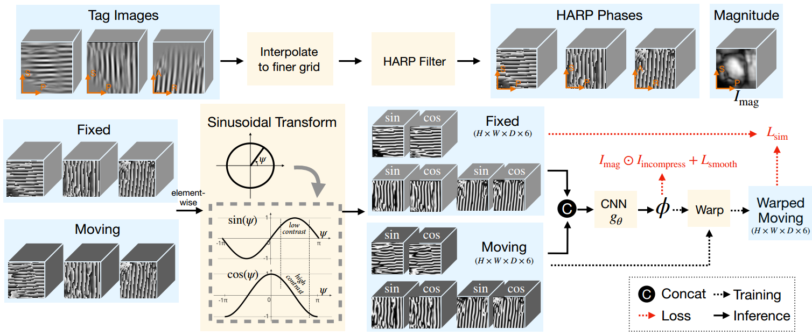
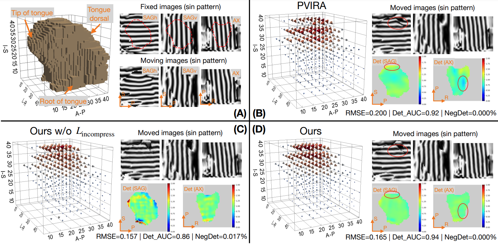

# DRIMET-tagged-MRI (MIDL 2023 Oral)

This is the official repository for the paper: DRIMET: Deep Registration-based 3D Incompressible Motion Estimation in
Tagged-MRI with Application to the Tongue

Paper link: https://arxiv.org/pdf/2301.07234.pdf

Key facts of LKU-Net:

- Deep learning-powered phase-based tagged-MRI tracking
- Estimate 3D dense _incompressible_ motion
- Generalize to unseen patients (pathology cases)



# Citation

If you find this repo helpful, please consider citing our work.

```bibtex
@inproceedings{bian2023drimet,
  title={DRIMET: Deep Registration-based 3D Incompressible Motion Estimation in Tagged-MRI with Application to the Tongue},
  author={Bian, Zhangxing and Xing, Fangxu and Yu, Jinglun and Shao, Muhan and Liu, Yihao and Carass, Aaron and Zhuo, Jiachen and Woo, Jonghye and Prince, Jerry L},
  booktitle={Medical Imaging with Deep Learning},
  year={2023}
}
```

# How to run

train:

```shell
python src/train.py  model=catjmag model.loss.w_in=0.27 model.loss.incompress_form="abslog_diffeo" trainer.max_epochs=50 logger.wandb.group="catjmag" logger.wandb.tags=["long"]
```

Finetuning from a checkpoint:

```shell
python src/train.py trainer.devices=[1] ckpt_path='path/to/pretrained/ckpt' datamodule=pvira datamodule.train_json="munge/patient_only.json" model=catjmag model.loss.w_in=0.27  model.loss.incompress_form="abslog" model.net.start_channel=16 trainer.max_epochs=60 logger.wandb.group="catjmag" logger.wandb.tags=["patient_finetune"]
```

test:

```shell
test_json=data/munge/E01_pvira_test_pair.json
python src/eval.py model=catjmag model.name=<ANY_NAME> ckpt_path='path/to/ckpt' datamodule.test_json=$test_json
```



# Breakdown of the code structure

The high-level structure of the code is based
on [PyTorch Lightning + Hydra](https://github.com/ashleve/lightning-hydra-template), which is a very user-friendly template for
DL experimentation. 

```text
├── configs                   <- Hydra configs
│   ├── callbacks                <- Callbacks configs
│   ├── data                     <- Data configs
│   ├── debug                    <- Debugging configs
│   ├── experiment               <- Experiment configs
│   ├── extras                   <- Extra utilities configs
│   ├── hparams_search           <- Hyperparameter search configs
│   ├── hydra                    <- Hydra configs
│   ├── local                    <- Local configs
│   ├── logger                   <- Logger configs
│   ├── model                    <- Model configs
│   ├── paths                    <- Project paths configs
│   ├── trainer                  <- Trainer configs
│   │
│   ├── eval.yaml             <- Main config for evaluation
│   └── train.yaml            <- Main config for training
├── src                    <- Source code
│   ├── data                     <- Data scripts
│   ├── models                   <- Model scripts
│   ├── utils                    <- Utility scripts
│   │
│   ├── eval.py                  <- Run evaluation
│   └── train.py                 <- Run training
├── .gitignore                <- List of files ignored by git
```

In the `src` folder, 
- `src/datamodules` 
  - The code Dataset and Dataloader
- `src/models`
  - The code for the network architecture
  - The code for the loss function
  - The code for the training loop
  - The code for the evaluation loop
  - Other utility functions, such as jacobian determinant, spatial warping, etc.

# Acknowledgement

The code is based on [Pytorch lightning](https://github.com/Lightning-AI/lightning)
, [VoxelMorph](https://github.com/voxelmorph/voxelmorph), [LKUnet](https://github.com/xi-jia/LKU-Net)
, [Lightning-hydra-template ](https://github.com/ashleve/lightning-hydra-template), we thank the authors for their great
work.

